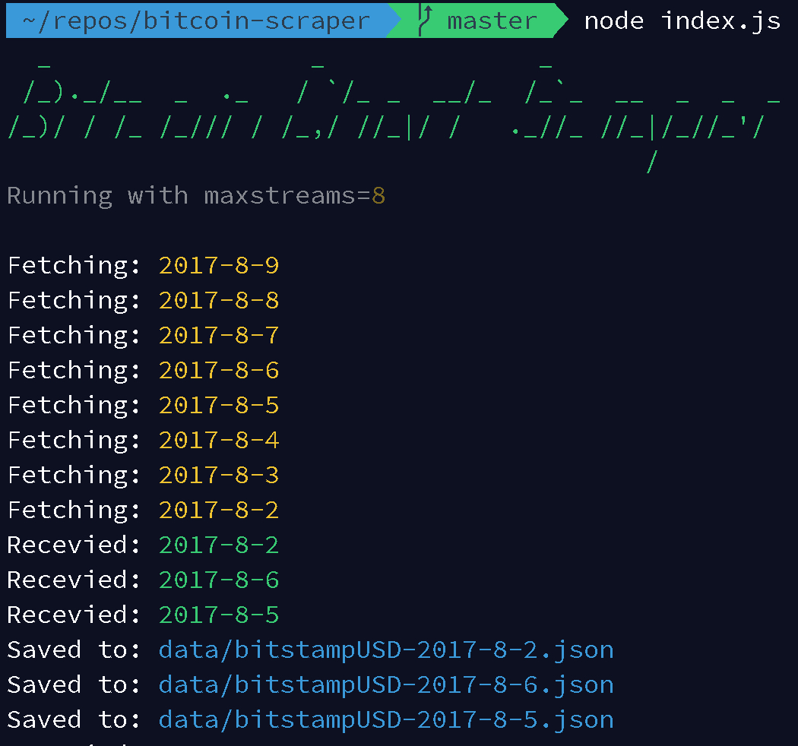
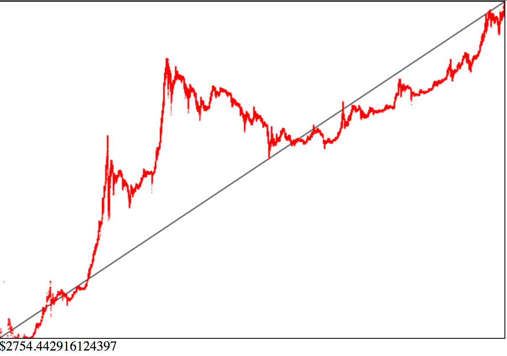

# Bitcoin Chart Scraper

Scrape the entire Bitcoin chart history to JSON.



## Install & Scrape

```shell
git clone https://github.com/F1LT3R/bitcoin-scraper.git
cd bitcoin-scraper
npm install
mkdir data
node scrape.js
```

## Output Example

```shell
  _                 _              _
 /_)._/__  _  ._   / `/_ _  __/_  /_`_  __  _  _  _
/_)/ / /_ /_/// / /_,/ //_|/ /   ._//_ //_|/_//_'/
                                          /
Running with maxstreams=8

Fetching: 2017-8-9
Fetching: 2017-8-8
Fetching: 2017-8-7
Fetching: 2017-8-6
Fetching: 2017-8-5
Fetching: 2017-8-4
Fetching: 2017-8-3
Fetching: 2017-8-2
Recevied: 2017-8-3
Saved to: data/bitstampUSD-2017-8-3.json
Recevied: 2017-8-9
Saved to: data/bitstampUSD-2017-8-9.json
Recevied: 2017-8-6
Saved to: data/bitstampUSD-2017-8-6.json
Recevied: 2017-8-7
Saved to: data/bitstampUSD-2017-8-7.json
...
DONE!
```

## Data Structure

```json
[
  [
    1419033600,
    318.58,
    318.58,
    318.58,
    318.58,
    0.01719605,
    5.478317609,
    318.58
  ],
  ...
```

## Columns

| Timestamp  |  Open  |  High  |  Low   | Close  | Volume (BTC) | Volume (Currency) | Weighted Price (USD) |
|------------|--------|--------|--------|--------|--------------|-------------------|----------------------|
| 1419033600 | 318.58 | 318.58 | 318.58 | 318.58 |   0.01719605 |       5.478317609 |               318.58 |


## Le Combine...

Combine all data into one file sequentially.

```shell
node combine.js data/bitcoin-history.json
```

## Chart...



```shell
npm install http-server -g
http-server
# point your browser to http://localhost:8080/chart.html
```
